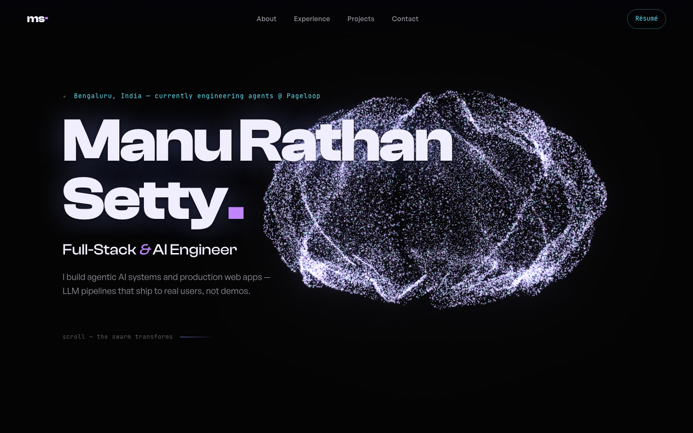
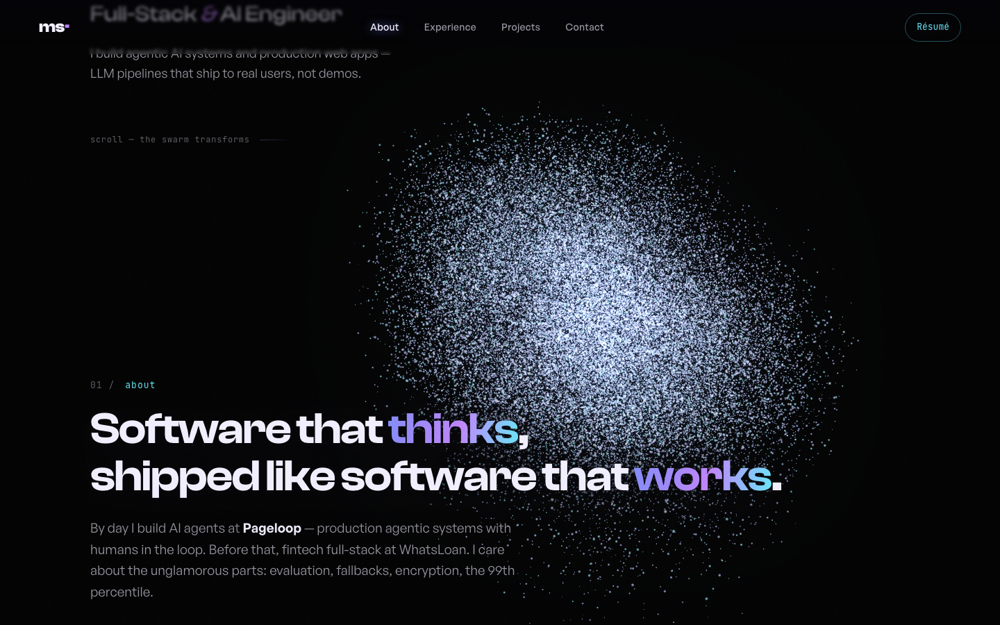

<div align="center">

# ✦ Metamorphosis

**One swarm. 60,000 particles. Five forms.**

My portfolio — a single GPU particle system that morphs through a brain, a neuron tree,
a globe, project satellites, and finally my name, driven entirely by scroll.

[**Live site**](https://manurathansetty.github.io) · [Manu Rathan Setty](https://www.linkedin.com/in/manu-rathan-setty-s-5857a8249) — Full-Stack & AI Engineer, Bengaluru




</div>

## The idea

Most Three.js portfolios are dots connected by lines floating in a void. This one refuses.

A single swarm of **60,000 particles** is the protagonist of the whole page. It never
leaves the screen — it *becomes* things as you scroll:

| Section | The swarm becomes | Detail |
|---|---|---|
| Hero | 🧠 an anatomical brain | twin hemispheres, noise-carved cortical folds, breathing |
| About | a branching neuron tree | light pulses climb the dendrites, synapse tips bloom |
| Experience | a globe | fbm landmasses, Bengaluru pulsing as a beacon |
| Projects | five orbiting satellites | the active project's orb drifts forward and brightens |
| Contact | **MANU** | the name assembles from rasterised letterforms |

Between forms, every particle takes its own curl-noise path with a per-particle stagger —
the swarm scatters like a flock of starlings, then snaps into the next shape.

<div align="center">

</div>

## Interactions

- **Cursor repulsion** — particles scatter away from the pointer like fish, then swarm home
- **Click shockwave** — an expanding ripple band rolls through whatever shape is on screen
- **Scroll scrubbing** — you drive the metamorphosis; nothing runs on a timer
- **Idle life** — per-particle shimmer, micro-orbit, and twinkle, so the shape is never static

## How it works

Everything is **procedural** — there is not a single 3D model file in this repo.

- **Stateless GPU morphing.** All five shapes live as vertex attributes (`aShape0..aShape4`,
  xyz + meta). The vertex shader blends between two of them with a per-particle eased
  stagger, adds simplex-curl turbulence proportional to transit, applies mouse repulsion
  and shockwaves — all derived from `uTime` and a handful of uniforms. No ping-pong FBOs,
  no simulation state, nothing to desync.
- **Shape generation** (`src/gl/shapes.ts`): a noise-wrinkled twin-hemisphere ellipsoid
  (brain), recursive luminous dendrites (neurons), a fibonacci sphere with fbm landmasses
  (globe), gaussian cluster orbs with orbit rings (satellites), and canvas-rasterised
  text sampling (name). Deterministic mulberry32 seeds — the swarm is identical on every visit.
- **Scroll direction** (`src/scroll.ts`): Lenis smooth scroll; the viewport centre
  interpolates between section centres to produce a continuous timeline `t ∈ [0..4]`.
- **Look**: additive blending + UnrealBloom, ACES tone mapping, film grain, frosted-glass
  cards over real DOM text (SEO-readable, copy-pastable).
- **Fallbacks**: `prefers-reduced-motion` and no-WebGL visitors get a static illuminated
  layout with identical content. Mobile runs an 18k-particle swarm.

## Run it

```bash
npm install
npm run dev        # vite dev server
npm run build      # type-check + production build
node scripts/verify.mjs   # headless Chromium: screenshots every section, fails on JS errors
```

## Type

Clash Display · General Sans · JetBrains Mono

---

<div align="center">

*Every photon on this page is procedural. No 3D models were harmed.*

</div>
